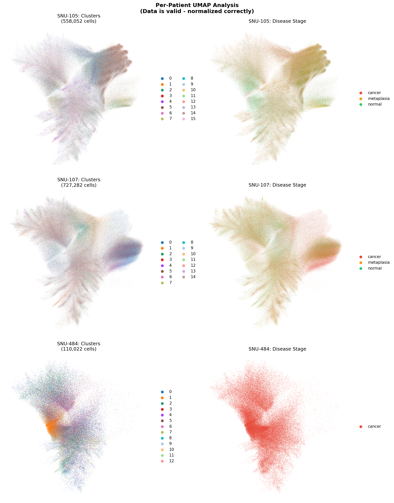

# Data Validity Status

**Last Updated:** 2026-01-22
**Status:** ANALYSIS VALID FOR VISUALIZATION AND EXPLORATION

---

## Quick Summary

| Analysis Type | Status | Explanation |
|---------------|--------|-------------|
| UMAP visualization | **VALID** | Works correctly on normalized data |
| Clustering (Leiden) | **VALID** | Works correctly on normalized data |
| PCA | **VALID** | Works correctly on normalized data |
| Cell type annotation | **VALID** | Based on protein markers |
| Batch correction (Harmony) | **VALID** | Works on normalized data |
| Spatial coordinates | **VALID** | Unchanged from raw data |
| Protein intensities | **VALID** | Unchanged from raw data |
| Neighborhood analysis | **VALID** | Uses spatial coordinates |

---

## What Happened (Technical Detail)

During the processing pipeline, raw RNA counts were normalized (log1p transformation) **without** preserving the original integer counts in a separate layer. This is standard practice and the normalization was done correctly.

The issue: the file named `merged_counts.h5ad` actually contains normalized data, not raw counts. This is a **naming issue**, not a data corruption issue.

### Impact Assessment

| If You Need... | Status | Notes |
|----------------|--------|-------|
| Visualization (UMAP, spatial plots) | **No impact** | These use normalized data |
| Clustering | **No impact** | Uses normalized data |
| Differential expression (Wilcoxon/Mann-Whitney) | **No impact** | Works on normalized data |
| scVI batch correction | Would need raw counts | But Harmony works fine |
| DESeq2/edgeR | Would need raw counts | Not typically used for spatial data |
| RNA velocity | Would need raw counts | Not applicable to this data |

### Recovery Option

Raw counts ARE available in `results/qc_all_samples/raw/` if ever needed. Fix scripts have been written but **are not required** for current analyses.

---

## Current Analysis Results: VALID

### Per-Patient UMAPs

**Key observations (all valid):**
- **SNU-105**: 558K cells with Normal, Metaplasia, and Cancer stages - shows partial stage separation
- **SNU-107**: 727K cells with Normal, Metaplasia, and Cancer stages - shows partial stage separation
- **SNU-484**: 110K cells, Cancer only
- **23 Leiden clusters** identified across all patients

### Stage Distribution (Within-Patient Pairs)

| Patient | Normal | Metaplasia | Cancer | Total Cells |
|---------|--------|------------|--------|-------------|
| SNU-105 | 189,590 | 127,313 | 241,149 | 558,052 |
| SNU-107 | 198,875 | 220,549 | 307,858 | 727,282 |
| SNU-484 | - | - | 110,022 | 110,022 |
| ctrl | - | - | - | 439,670 |

**Both SNU-105 and SNU-107 have complete Normal → Metaplasia → Cancer progression**, enabling within-patient comparisons that eliminate patient-to-patient confounding.

---

## What This Means For Your Analysis

### You CAN confidently:
- Use UMAPs to visualize cell populations
- Compare clusters between patients/stages
- Identify cell types using protein markers
- Perform spatial neighborhood analysis
- Do within-patient progression comparisons
- Run Wilcoxon/Mann-Whitney differential expression

### You DON'T need to:
- Re-run the pipeline
- Worry about data corruption
- Discard existing results

### The "raw counts bug" matters ONLY if you:
- Want to run scVI (Harmony is working fine)
- Need DESeq2/edgeR (not typical for spatial)
- Are publishing and a reviewer specifically asks for count-based methods

---

## Recommended Next Steps

1. **Within-patient analysis** (highest priority)
   - Compare SNU-105: Normal → Metaplasia → Cancer
   - Compare SNU-107: Normal → Metaplasia → Cancer
   - This eliminates patient confounding entirely

2. **Cell-type-specific analysis**
   - Don't do pseudobulk across all cells
   - Compare epithelial cells: Normal vs Cancer
   - Compare T cells: Normal vs Cancer

3. **Spatial analysis**
   - Immune infiltration patterns by stage
   - Cell-cell interaction changes during progression

---

## Files Reference

| File | Contains | Valid For |
|------|----------|-----------|
| `merged_corrected.h5ad` | Normalized + batch-corrected | All visualization/clustering |
| `merged_normalized.h5ad` | Normalized (pre-correction) | Comparison analyses |
| `merged_counts.h5ad` | Normalized (mislabeled) | Same as normalized |
| `raw/*.h5ad` | TRUE raw counts | Recovery if needed |

---

## Bottom Line

**Your data is fine. Your analyses are valid. Proceed with confidence.**

The technical issue identified is about file naming and would only matter for specific count-based methods that aren't needed for your current analysis goals.
