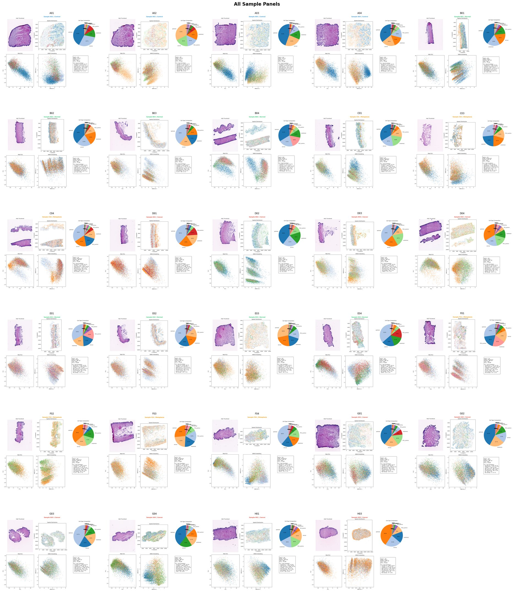

# G4X Choi Batch 2 Analysis

Comprehensive multimodal spatial transcriptomics analysis of G4X data from the Choi Lab (Batch 2).

## Sample Overview (29 QC-Passing Samples)



*PCA Deep Dive: Each panel shows H&E thumbnail, spatial cell distribution colored by cell type, cell type composition pie chart, RNA PCA, WNN embedding, and sample metadata. 1.83M total cells across normal → metaplasia → cancer progression.*

## Dataset Overview

| Metric | Value |
|--------|-------|
| **Platform** | G4X (imaging-based spatial transcriptomics) |
| **Software** | Caretta v25.08.0 |
| **Total Samples** | 32 (4 lanes × 8 samples) |
| **Total Cells** | 2,308,968 |
| **Total Transcripts** | 192,411,241 |
| **Transcript Panel** | 387 genes |
| **Protein Panel** | 17 markers (immune-focused) |

### Protein Panel (17 markers)

| Marker | Cell Type Association |
|--------|----------------------|
| CD3 | T cells (pan) |
| CD4 | Helper T cells |
| CD8 | Cytotoxic T cells |
| FOXP3 | Regulatory T cells |
| CD20 | B cells |
| CD45 | Pan-leukocyte |
| CD68 | Macrophages |
| CD11c | Dendritic cells |
| HLA-DR | Antigen-presenting cells |
| CD31 | Endothelial cells |
| PanCK | Epithelial cells |
| aSMA | Stromal/myofibroblasts |
| KI67 | Proliferating cells |
| PD1 | Checkpoint (T cells) |
| PDL1 | Checkpoint (tumor/immune) |
| ATPase | Metabolic |
| Isotype | Negative control |

### RNA Panel Details (337 Genes + 50 Controls)

The transcript panel consists of 241 genes from the standard IO panel plus 146 VUMC addon genes for gastric cancer research.

#### Key Gene Categories

| Category | Genes |
|----------|-------|
| **Gastric Markers** | CDX1, CDX2, MUC1, MUC2, MUC4, MUC5AC, MUC6, TFF1, TFF2, TFF3, PGC, GAST, ATP4A, GHRL, SST |
| **Epithelial** | EPCAM, CDH1, CDH17, CLDN1, CLDN3, CLDN4, CLDN7, CLDN18, TACSTD2 |
| **CAF Markers** | COL1A1, FAP, PDGFRA, PDGFRB, ACTA2, TAGLN, THY1, PDPN, FN1, POSTN, LUM, VCAN |
| **T Cell** | CD3D, CD3E, CD4, CD8A, FOXP3, GZMA, GZMB, GZMH, GZMK, PRF1, IFNG, IL2RA, IL7R |
| **Checkpoint** | PDCD1 (PD1), CD274 (PDL1), CTLA4, LAG3, HAVCR2 (TIM3), TIGIT |
| **B/Plasma** | MS4A1, CD19, CD79A, IGHA1, IGHG1, IGHM, JCHAIN, SDC1 |
| **Myeloid** | CD14, CD68, CD163, ITGAM, CSF1R, MRC1 |
| **Cytokines** | CCL2, CCL3, CCL4, CCL5, CXCL9, CXCL10, CXCL11, CXCL13, IL1B, IL6, IL10, TGFB1, TNF |
| **Stem/Progenitor** | LGR5, PROM1, OLFM4, SOX2, SOX9 |
| **Oncogenes/DDR** | TP53, KRAS, EGFR, ERBB2, MET, APC, BRCA1, MLH1, MSH6 |

### Per-Cell Metadata Available

| Field | Description |
|-------|-------------|
| `cell_x`, `cell_y` | Spatial coordinates (µm) |
| `nuclei_area` | Nuclear area (µm²) |
| `[PROTEIN]_intensity_mean` | 17 protein marker intensities |
| `n_genes_by_counts` | Number of genes detected |
| `total_counts` | Total transcript counts |

### Per-Sample Metadata Available

| Field | Description |
|-------|-------------|
| `total_tissue_area_mm^2` | Total tissue area |
| `number_cells` | Cell count |
| `median_transcripts_per_cell` | RNA depth |
| `median_unique_genes_per_cell` | Gene diversity |
| `pct_transcripts_in_cells` | Assignment efficiency |
| `[PROTEIN]_snr` | Signal-to-noise ratio per protein |

### Data Limitations

| What's Missing | Impact |
|----------------|--------|
| **No tumor region annotation** | Cannot distinguish tumor vs normal epithelium at cell level within a sample |
| **No pathologist markup** | No gland/stroma/immune region boundaries drawn |
| **No clinical metadata** | No patient age, sex, TNM stage, grade, or treatment history |
| **Stage = ROI selection** | "C" (Cancer) suffix means ROI was selected from cancerous region, but individual cells are not labeled tumor/non-tumor |

#### Inferring Tumor Phenotype

Since we lack direct tumor annotations, we infer tumor-related phenotypes from marker expression:

| Marker Pattern | Interpretation |
|----------------|----------------|
| PanCK+ CDX2+ MUC2+ | Intestinal metaplasia phenotype |
| PanCK+ CDX2- MUC5AC+ | Gastric foveolar phenotype |
| PanCK+ KI67-high | Proliferating epithelium (likely tumor) |
| PanCK+ PDL1+ | Tumor with checkpoint expression |
| aSMA+ PDGFRA+ | Cancer-associated fibroblast (CAF) |

### Sample Summary

| Sample | Cells | Med. Trans/Cell | Med. Genes/Cell |
|--------|------:|----------------:|----------------:|
| A01 | 127,792 | 42 | 28 |
| B01 | 30,194 | 69 | 36 |
| C01 | 38,588 | 47 | 29 |
| D01 | 31,711 | 64 | 35 |
| E01 | 34,353 | 60 | 35 |
| F01 | 62,875 | 34 | 26 |
| G01 | 158,727 | 81 | 46 |
| H01 | 85,842 | 84 | 42 |
| A02 | 120,260 | 48 | 32 |
| B02 | 37,511 | 64 | 38 |
| C02 | 52,588 | 55 | 35 |
| D02 | 56,035 | 48 | 32 |
| E02 | 31,790 | 51 | 33 |
| F02 | 33,857 | 56 | 35 |
| G02 | 79,634 | 89 | 50 |
| H02 | 87,215 | 109 | 55 |
| A03 | 145,070 | 48 | 31 |
| B03 | 38,095 | 57 | 33 |
| C03 | 21,231 | 47 | 30 |
| D03 | 33,227 | 48 | 31 |
| E03 | 86,003 | 63 | 41 |
| F03 | 82,704 | 50 | 33 |
| G03 | 45,583 | 67 | 40 |
| H03 | 35,585 | 126 | 36 |
| A04 | 130,891 | 65 | 38 |
| B04 | 119,211 | 67 | 29 |
| C04 | 89,387 | 74 | 33 |
| D04 | 169,683 | 75 | 32 |
| E04 | 68,014 | 67 | 34 |
| F04 | 78,831 | 62 | 30 |
| G04 | 64,147 | 53 | 29 |
| H04 | 32,334 | 25 | 11 |

## Study Design & Sample Metadata

### Disease Stage Classification

Samples are labeled with disease stage suffixes in the block name:
- **N** = Normal gastric mucosa
- **M** = Intestinal Metaplasia (pre-malignant)
- **C** = Gastric Cancer
- **X** = Adjacent/other tissue

### Complete Sample Inventory (32 samples)

| Lane | Position | Patient | Stage | Tissue | Cells | Analyzed |
|:----:|:--------:|---------|:-----:|--------|------:|:--------:|
| L001 | A01 | WD112575 (CRC ctrl) | Ctrl | colon | 127,792 | ✅ |
| | B01 | SNU-103 | **N** | stomach | 30,194 | ✅ |
| | C01 | SNU-103 | **M** | stomach | 38,588 | ✅ |
| | D01 | SNU-105 | **N** | stomach | 31,711 | ✅ |
| | E01 | SNU-105 | **M** | stomach | 34,353 | ✅ |
| | F01 | SNU-105 | **C** | stomach | 62,875 | ✅ |
| | G01 | SNU-109 | **C** | stomach | 158,727 | ✅ |
| | H01 | SNU-109 | X | stomach | 85,842 | ✅ |
| L002 | A02 | WD112575 (CRC ctrl) | Ctrl | colon | 120,260 | |
| | B02 | SNU-106 | N | stomach | 37,511 | |
| | C02 | SNU-106 | C | stomach | 52,588 | |
| | D02 | SNU-106 | N | stomach | 56,035 | |
| | E02 | SNU-107 | N | stomach | 31,790 | |
| | F02 | SNU-107 | M | stomach | 33,857 | |
| | G02 | SNU-107 | C | stomach | 79,634 | |
| | H02 | SNU-107 | C | stomach | 87,215 | |
| L003 | A03 | WD112575 (CRC ctrl) | Ctrl | colon | 145,070 | |
| | B03 | SNU-108 | M | stomach | 38,095 | |
| | C03 | SNU-108 | C | stomach | 21,231 | |
| | D03 | SNU-108 | M | stomach | 33,227 | |
| | E03 | SNU-110 | C | stomach | 86,003 | |
| | F03 | SNU-110 | X | stomach | 82,704 | |
| | G03 | UTSW-4 | body | stomach | 45,583 | |
| | H03 | UTSW-4 | fundus | stomach | 35,585 | |
| L004 | A04 | WD112575 (CRC ctrl) | Ctrl | colon | 130,891 | |
| | B04 | Hu13 | C | stomach | 119,211 | |
| | C04 | Hu13 | M | stomach | 89,387 | |
| | D04 | Hu13 | C | stomach | 169,683 | |
| | E04 | Hu15 | X | stomach | 68,014 | |
| | F04 | Hu15 | X | stomach | 78,831 | |
| | G04 | Hu15 | X | stomach | 64,147 | |
| | H04 | Hu15 | X | stomach | 32,334 | |

### Summary by Disease Stage

| Stage | Total Samples | Total Cells | Currently Analyzed |
|-------|:-------------:|------------:|:------------------:|
| **Normal (N)** | 6 | 187,241 | 2 |
| **Metaplasia (M)** | 7 | 267,507 | 2 |
| **Cancer (C)** | 10 | 857,167 | 2 |
| Adjacent/Other (X) | 5 | 333,525 | 1 |
| Colon Control | 4 | 524,013 | 1 |
| **TOTAL** | **32** | **2,169,453** | **8** |

### Matched Progression Series

Patients with multiple disease stages enabling within-patient Normal → Metaplasia → Cancer comparison:

| Patient | Normal | Metaplasia | Cancer | Status |
|---------|:------:|:----------:|:------:|--------|
| **SNU-105** | D01 | E01 | F01 | ✅ **Complete N→M→C (all analyzed)** |
| SNU-107 | E02 | F02 | G02, H02 | Complete N→M→C |
| SNU-103 | B01 | C01 | - | N→M only (analyzed) |
| SNU-106 | B02, D02 | - | C02 | N→C (no M) |
| SNU-108 | - | B03, D03 | C03 | M→C only |
| Hu13 | - | C04 | B04, D04 | M→C only |

**Key finding:** SNU-105 (D01→E01→F01) provides the only complete matched Normal→Metaplasia→Cancer progression series in the analyzed samples.

## Analysis Pipeline

### 1. Quality Control
- Cell/sample QC metrics
- Protein signal-to-noise ratio
- Transcript quality assessment

### 2. Cell Type Annotation
- Protein marker-based gating
- Unsupervised clustering
- Cell type identification

### 3. Multimodal Integration
- RNA-protein correlation
- Cross-modality validation
- Concordance analysis

### 4. Spatial Analysis
- Neighborhood enrichment
- Cell-cell interactions
- Spatial niche identification

### 5. Hypothesis-Driven Analysis
- Immune infiltration patterns
- TME composition
- Checkpoint expression analysis

## Documentation

| Document | Description |
|----------|-------------|
| [📊 DATA_DOCUMENTATION.md](docs/DATA_DOCUMENTATION.md) | Comprehensive dataset documentation with sample metrics, QC, and cell type distributions |
| [📋 PROJECT_IDEAS_RANKED.md](docs/PROJECT_IDEAS_RANKED.md) | Ranked project ideas with feasibility/significance scoring |
| [📚 G4X_Project_Ideas_Evidence_Based.md](docs/G4X_Project_Ideas_Evidence_Based.md) | Literature-grounded project prioritization with Polymath/Vanderbilt references |
| [🖥️ G4X_Project_Ideas.html](docs/G4X_Project_Ideas.html) | Interactive React dashboard for project exploration |

## Repository Structure

```
g4x-choi-batch2-analysis/
├── scripts/           # Analysis scripts
├── data/              # Processed data
├── docs/              # Project documentation
│   ├── DATA_DOCUMENTATION.md
│   ├── PROJECT_IDEAS_RANKED.md
│   ├── G4X_Project_Ideas_Evidence_Based.md
│   └── G4X_Project_Ideas.html
├── results/
│   ├── figures/       # Publication figures
│   └── tables/        # Summary tables
├── notebooks/         # Exploratory notebooks
└── README.md
```

## Data Location

Raw data: `/mnt/x/Choi_Batch_2_Tuesday/`

## Requirements

- Python 3.10+
- scanpy, squidpy, anndata
- pandas, numpy, scipy
- matplotlib, seaborn

## Usage

```bash
# Run full analysis pipeline
python scripts/01_qc_analysis.py
python scripts/02_cell_type_annotation.py
python scripts/03_multimodal_integration.py
python scripts/04_spatial_analysis.py
python scripts/05_hypothesis_analysis.py
```

## Key Findings

### Quality Control
- **32 samples** analyzed, 2.3M total cells
- Mean 62.3 transcripts/cell, 34.3 genes/cell
- All protein markers show high SNR (>10), with PanCK highest (96.0)
- 2 samples flagged for low transcript detection (F01: 34, H04: 25)
- **29 samples pass QC** (H04 excluded for low transcripts; C02, H02 excluded for WNN processing issues)

### PCA Deep Dive ([`scripts/46_pca_deep_dive.py`](scripts/46_pca_deep_dive.py))

**Key Finding: No significant transcriptional separation between disease stages at sample level.**

| Test | Statistic | P-value | Interpretation |
|------|-----------|---------|----------------|
| Kruskal-Wallis | 1.97 | **0.578** | Stages not different |
| Spearman ρ | -0.08 | 0.673 | No progression trend |

**Variance Decomposition (PC1):**
| Factor | R² | Category |
|--------|-----|----------|
| **Cell type** | **19.2%** | Biological |
| Lane (batch) | 5.6% | Technical |
| Stage | 1.3% | Biological |
| Patient | 1.2% | Technical |

**Conclusion:** Cell type composition dominates transcriptional variance (19.2%), masking any stage-related signal (1.3%). This indicates that **cell type-stratified analyses** are needed to detect progression-associated changes, rather than bulk sample comparisons.

**Implication:** Biological differences between Normal → Metaplasia → Cancer likely exist *within* specific cell types (e.g., epithelial dedifferentiation, CAF activation, T cell exhaustion) rather than as global transcriptional shifts.

*Full results: [`results/pca_deep_dive/`](results/pca_deep_dive/) including 10 figures, 29 sample panels, and statistical outputs.*

### Cell Type Composition
| Cell Type | Mean % | Range |
|-----------|-------:|------:|
| Epithelial | 18.7% | 17.3-19.9% |
| Stromal | 12.2% | 5.2-16.1% |
| Endothelial | 12.4% | 9.4-15.6% |
| CD8+ T cells | 3.4% | 0.9-9.1% |
| B cells | 2.9% | 1.3-4.9% |
| Macrophages | 2.5% | 0.9-4.8% |
| CD4+ T cells | 2.0% | 0.6-3.4% |
| Tregs | 0.8% | 0.1-2.0% |

### Multimodal Integration (RNA-Protein Correlation)
- Mean Spearman r = 0.088 (typical for imaging platforms)
- **Best correlations:** HLA-DR (0.31), aSMA (0.18), CD68 (0.17)
- **Weakest correlations:** KI67 (0.003), FOXP3 (0.01), PD1 (0.02)
- Low correlation may indicate post-transcriptional regulation

### Spatial Analysis - Neighborhood Enrichment

**Strong co-localization (positive z-score):**
- B cells ↔ CD8 T cells (z=4.37)
- CD8 T ↔ Immune_other (z=14.61)
- CD4 T ↔ Tregs (z=5.49)
- All immune cells cluster together

**Strong avoidance (negative z-score):**
- Epithelial ↔ Stromal (z=-17.0)
- Epithelial ↔ Immune (z=-5 to -11)
- Clear tissue compartmentalization

**Self-aggregation:**
- All cell types show homotypic clustering
- Epithelial cells: z=44.25 (highest)
- Endothelial cells: z=28.50

### Immune Microenvironment
- **Total immune:** 20.0% across samples
- **CD8/Treg ratio:** 7.3 ± 9.5 (favorable in most samples)
- **PD1+ T cells:** 29.0% ± 13.2%
- **PDL1+ tumor:** 25.3% ± 9.0%
- **CD8 exhaustion:** 25% of CD8+ T cells show exhaustion phenotype

### Notable Samples
| Category | Samples | Characteristic |
|----------|---------|----------------|
| High CD8/Treg ratio | B01 (39.3), H03 (38.4) | Favorable immune |
| Low CD8/Treg ratio | A03 (0.9), A04 (1.3) | Treg-dominated |
| High PDL1 tumor | 11 samples >30% | Checkpoint expression |

## Figures

| Figure | Description |
|--------|-------------|
| `qc_overview.png` | Sample QC metrics |
| `protein_snr.png` | Protein signal-to-noise |
| `cell_type_composition.png` | Cell type proportions |
| `marker_expression_by_celltype.png` | Marker validation |
| `protein_rna_correlation.png` | Multimodal concordance |
| `neighborhood_enrichment.png` | Cell-cell interactions |
| `spatial_maps.png` | Spatial distributions |
| `immune_infiltration.png` | TME composition |
| `exhaustion_analysis.png` | T cell exhaustion |

## Author

Max Van Belkum, MD-PhD Student, Vanderbilt University

## Date

January 2026
