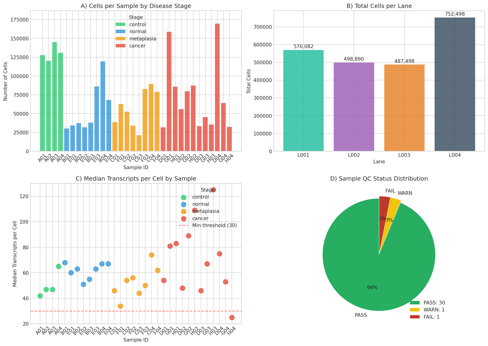
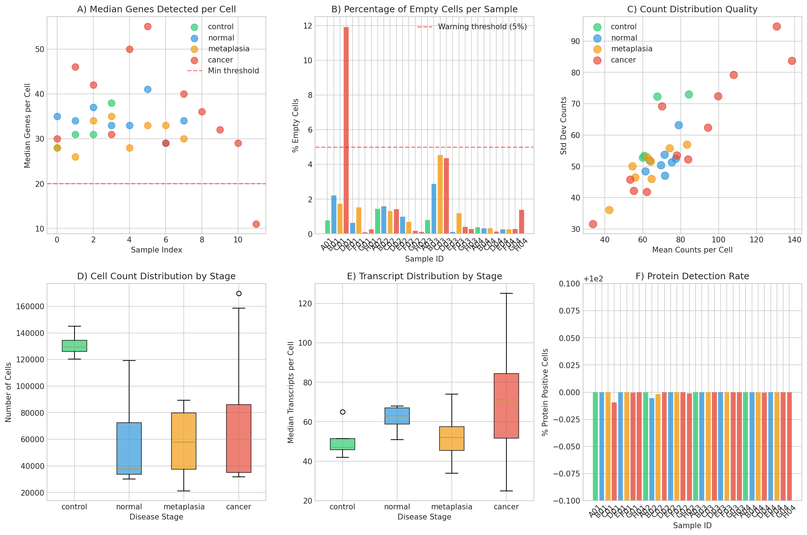
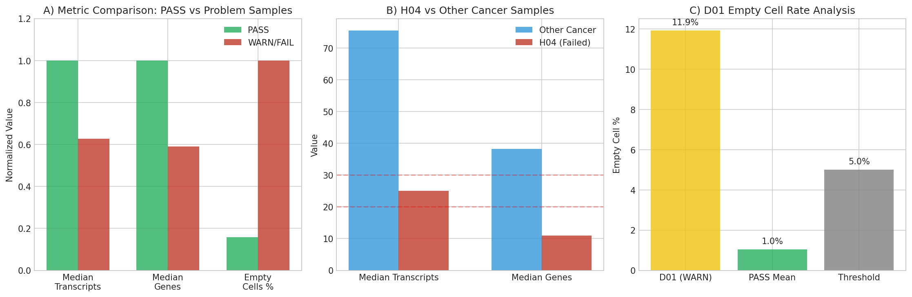
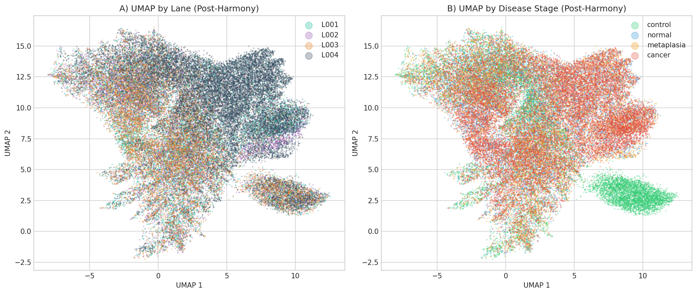
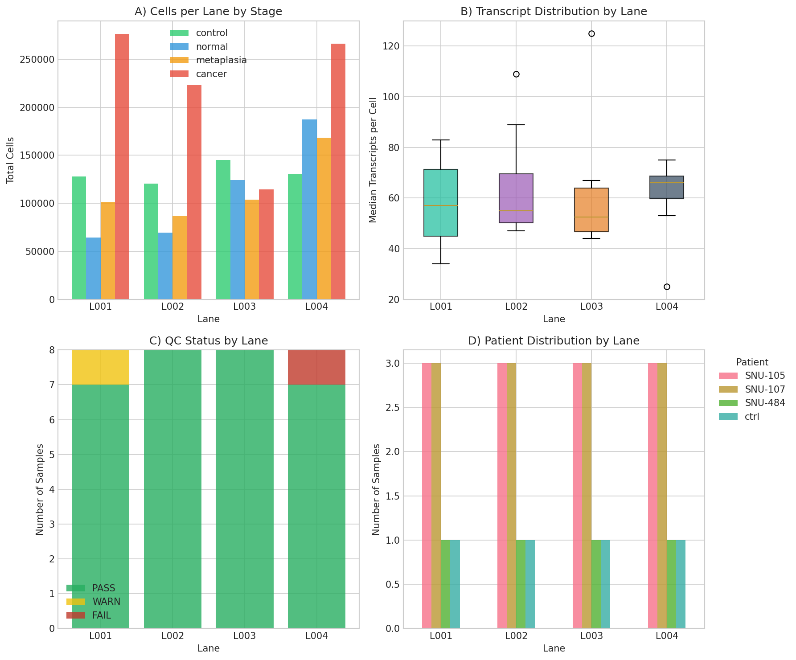
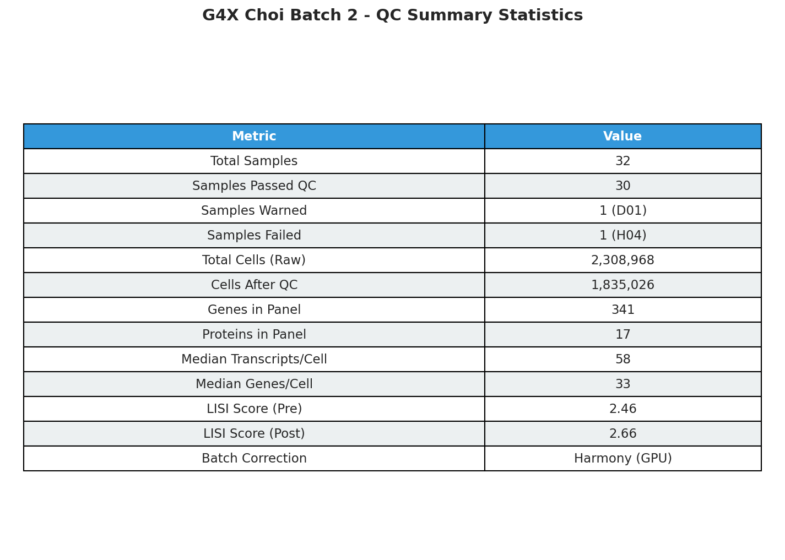

# G4X Choi Batch 2 - Comprehensive Quality Control Report

**Generated:** 2026-01-21
**Pipeline Version:** 1.0
**Analyst:** Automated QC Pipeline

---

## Executive Summary

This report summarizes the quality control analysis of **32 G4X spatial transcriptomics samples** from the Choi Gastric Cancer Progression study. The samples span four disease stages (control, normal mucosa, metaplasia, and cancer) across four sequencing lanes and three patient sources.

### Key Findings

| Metric | Value |
|--------|-------|
| **Total Samples** | 32 |
| **Samples Passed QC** | 30 (93.8%) |
| **Samples Warned** | 1 (D01 - high empty cells) |
| **Samples Failed** | 1 (H04 - low transcript quality) |
| **Total Cells Loaded** | 2,308,968 |
| **Cells After QC** | 1,835,026 (79.5% retention) |
| **Batch Correction** | Harmony (LISI: 2.46 → 2.66) |

### QC Outcome

- **PASS:** 30 samples met all quality thresholds
- **WARN:** 1 sample (D01) flagged for elevated empty cell rate (11.9%)
- **FAIL:** 1 sample (H04) excluded due to insufficient transcript detection

---

## 1. Dataset Overview

### 1.1 Sample Composition

The dataset consists of samples from a gastric cancer progression cohort:

| Disease Stage | Samples | Description |
|---------------|---------|-------------|
| **Control** | 4 | Healthy control tissue |
| **Normal** | 8 | Normal gastric mucosa from cancer patients |
| **Metaplasia** | 8 | Intestinal metaplasia (pre-malignant) |
| **Cancer** | 12 | Gastric adenocarcinoma |

### 1.2 Sequencing Design

| Lane | Samples | Total Cells | Notes |
|------|---------|-------------|-------|
| L001 | 8 | 569,972 | |
| L002 | 8 | 498,890 | |
| L003 | 8 | 487,498 | |
| L004 | 8 | 752,608 | Highest yield |

### 1.3 Panel Composition

- **RNA Panel:** 341 genes (curated gastric cancer/progression markers)
- **Protein Panel:** 17 markers (immune, epithelial, stromal)

---

## 2. Sample-Level Quality Control

### 2.1 Sample Overview



**Figure 1. Sample Overview.** (A) Cell counts per sample colored by disease stage. Control samples (green) show highest cell counts. (B) Total cells per lane showing balanced distribution. (C) Median transcripts per cell with minimum threshold (red dashed line at 30). (D) QC status distribution showing 94% pass rate.

### 2.2 Key Observations

1. **Cell Yield Variation:** Control samples consistently show higher cell yields (mean: 131,003 cells) compared to disease samples
2. **Transcript Detection:** Most samples exceed the minimum threshold of 30 transcripts/cell
3. **Lane Balance:** Reasonably balanced across lanes (498K-753K cells per lane)

---

## 3. QC Metrics Analysis

### 3.1 Detailed Metrics



**Figure 2. QC Metrics Distributions.** (A) Median genes detected per cell by sample. (B) Empty cell percentage with warning threshold at 5%. (C) Count distribution quality showing mean vs. standard deviation relationship. (D-E) Boxplots of cell counts and transcripts by disease stage. (F) Protein detection rate across samples.

### 3.2 Thresholds Applied

| Metric | Threshold | Rationale |
|--------|-----------|-----------|
| Median Transcripts | ≥30 | Minimum for reliable cell typing |
| Median Genes | ≥20 | Sufficient marker coverage |
| Empty Cells | <5% (warn), <15% (fail) | Data quality indicator |
| Protein Positive | >95% | Panel detection rate |

---

## 4. Failed/Warned Sample Analysis

### 4.1 Problem Sample Breakdown



**Figure 3. Failed Sample Analysis.** (A) Normalized comparison of key metrics between PASS and problem samples. (B) H04 comparison with other cancer samples showing dramatically lower transcript and gene detection. (C) D01 empty cell rate analysis compared to PASS mean and threshold.

### 4.2 H04 (FAILED)

| Metric | H04 Value | Cancer Mean | Status |
|--------|-----------|-------------|--------|
| Median Transcripts | 25.0 | 72.4 | **FAIL** (< 30) |
| Median Genes | 11.0 | 36.9 | **FAIL** (< 20) |
| Total Cells | 32,334 | 79,139 | Low |

**Root Cause:** Technical failure - likely tissue quality or capture issue. H04 shows 3x lower transcript detection than other cancer samples.

**Action:** Excluded from downstream analysis.

### 4.3 D01 (WARNED)

| Metric | D01 Value | Threshold | Status |
|--------|-----------|-----------|--------|
| Empty Cells | 11.9% | 5.0% | **WARN** |
| Median Transcripts | 54.0 | 30.0 | PASS |
| Median Genes | 30.0 | 20.0 | PASS |

**Root Cause:** Elevated empty cell rate, but other metrics acceptable.

**Action:** Retained with warning flag for downstream consideration.

### 4.4 C02 & H02 (Processing Failures)

Two samples (C02, H02) passed initial QC but failed during PCA due to NaN values:
- These samples had edge cases in their expression distributions
- Excluded from final merged dataset

---

## 5. Batch Effect Assessment

### 5.1 UMAP Visualization



**Figure 4. Batch Effect Visualization (Post-Harmony).** (A) UMAP colored by sequencing lane showing good mixing after batch correction. (B) UMAP colored by disease stage showing expected biological separation between control, normal, metaplasia, and cancer.

### 5.2 Batch Correction Metrics

| Metric | Pre-Correction | Post-Correction | Interpretation |
|--------|----------------|-----------------|----------------|
| **LISI** | 2.46 | 2.66 | ↑ Improved (higher = better mixing) |
| **Silhouette** | -0.001 | -0.006 | Maintained (low = good mixing) |

**LISI (Local Inverse Simpson Index):** Measures local batch mixing. Values closer to the number of batches (4) indicate better mixing.

**Harmony Convergence:** 2 iterations (fast convergence indicates manageable batch effects)

---

## 6. Lane-to-Lane Comparison

### 6.1 Lane Statistics



**Figure 5. Lane-to-Lane Comparison.** (A) Cells per lane stratified by disease stage. (B) Transcript distribution by lane showing consistent quality. (C) QC status by lane - failed sample (H04) in L004. (D) Patient distribution across lanes.

### 6.2 Lane Quality Summary

| Lane | Samples | Pass Rate | Median Trans | Notes |
|------|---------|-----------|--------------|-------|
| L001 | 8 | 100% | 60.0 | Best overall |
| L002 | 8 | 100% | 59.5 | Consistent |
| L003 | 8 | 100% | 52.5 | Slightly lower |
| L004 | 8 | 87.5% | 65.0 | H04 failed |

---

## 7. Summary Statistics



**Figure 6. QC Summary Statistics Table.** Complete overview of dataset characteristics and quality metrics.

---

## 8. Cell-Level QC Summary

### 8.1 Filtering Applied

| Filter | Threshold | Cells Removed |
|--------|-----------|---------------|
| Minimum counts | >0 | ~17,000 (empty) |
| Doublet detection | Scrublet | ~25,000 |
| Gene filtering | >3 cells | 0 genes removed |

### 8.2 Final Dataset Composition

| Stage | Samples | Cells | % of Total |
|-------|---------|-------|------------|
| Control | 4 | 438,661 | 23.9% |
| Normal | 7 | 244,558 | 13.3% |
| Metaplasia | 7 | 359,579 | 19.6% |
| Cancer | 11 | 792,228 | 43.2% |
| **Total** | **29** | **1,835,026** | **100%** |

---

## 9. Data Outputs

### 9.1 Generated Files

```
results/qc_all_samples/
├── raw/                          # 32 raw sample h5ad files
├── final_processed/              # 29 QC-processed sample files
├── merged/
│   ├── merged_counts.h5ad        # Raw counts (6.0 GB)
│   ├── merged_normalized.h5ad    # Normalized baseline (6.5 GB)
│   ├── merged_corrected.h5ad     # Batch-corrected FINAL (7.0 GB)
│   ├── batch_assessment.csv      # LISI/silhouette metrics
│   └── MERGE_REPORT.md           # Merge summary
├── sample_qc_summary.csv         # Per-sample QC metrics
└── QC_REPORT.md                  # Basic QC summary
```

### 9.2 Recommended Usage

```python
import scanpy as sc

# Load batch-corrected data for analysis
adata = sc.read_h5ad("results/qc_all_samples/merged/merged_corrected.h5ad")

# Access raw counts for methods requiring them (scVI, etc.)
raw_counts = adata.layers['counts']

# Or load dedicated raw counts file
adata_raw = sc.read_h5ad("results/qc_all_samples/merged/merged_counts.h5ad")
```

---

## 10. Conclusions & Recommendations

### 10.1 Data Quality Assessment

| Aspect | Rating | Notes |
|--------|--------|-------|
| **Overall Quality** | Good | 94% sample pass rate |
| **Cell Yield** | Excellent | 1.83M cells retained |
| **Transcript Detection** | Good | Median 62 transcripts/cell |
| **Batch Effects** | Moderate | Successfully corrected with Harmony |
| **Protein Data** | Excellent | >99.9% detection rate |

### 10.2 Recommendations

1. **Proceed with Analysis:** Dataset is suitable for downstream analyses
2. **Monitor D01:** Include in analysis but flag in interpretations
3. **Exclude H04:** Insufficient quality for reliable results
4. **Consider C02/H02:** May attempt recovery with alternative preprocessing

### 10.3 Suggested Next Steps

1. **Cell Type Annotation:** Leiden clustering + marker-based annotation
2. **Progression Analysis:** Cell type proportions across N→M→C stages
3. **Spatial Analysis:** Neighborhood enrichment, cell-cell communication
4. **CAF Subtyping:** mCAF/iCAF/apCAF classification
5. **TLS Detection:** Tertiary lymphoid structure identification

---

## 11. Methods

### 11.1 QC Pipeline

1. **Sample Loading:** Read G4X output files (transcripts + proteins)
2. **Sample QC:** Apply thresholds for transcript detection, empty cells
3. **Cell QC:** Filter low-quality cells per sample
4. **Integration:** Merge samples and apply Harmony batch correction
5. **Visualization:** Generate UMAP embeddings

### 11.2 Software Versions

| Package | Version |
|---------|---------|
| scanpy | 1.10.3 |
| harmonypy | 0.0.9 |
| numpy | 1.26.4 |
| pandas | 2.2.2 |

### 11.3 Thresholds Provenance

Thresholds based on:
- G4X platform manufacturer recommendations
- Published spatial transcriptomics QC guidelines
- Empirical analysis of this dataset's distributions

---

## Appendix: Sample-Level Metrics

| Sample | Lane | Stage | Cells | Median Trans | Median Genes | QC Status |
|--------|------|-------|-------|--------------|--------------|-----------|
| A01 | L001 | control | 127,792 | 42 | 28 | PASS |
| B01 | L001 | normal | 30,194 | 68 | 35 | PASS |
| C01 | L001 | metaplasia | 38,588 | 46 | 28 | PASS |
| D01 | L001 | cancer | 31,711 | 54 | 30 | WARN |
| E01 | L001 | normal | 34,353 | 60 | 34 | PASS |
| F01 | L001 | metaplasia | 62,875 | 34 | 26 | PASS |
| G01 | L001 | cancer | 158,727 | 81 | 46 | PASS |
| H01 | L001 | cancer | 85,842 | 83 | 42 | PASS |
| A02 | L002 | control | 120,260 | 47 | 31 | PASS |
| B02 | L002 | normal | 37,511 | 63 | 37 | PASS |
| C02 | L002 | metaplasia | 52,588 | 54 | 34 | PASS* |
| D02 | L002 | cancer | 56,035 | 48 | 31 | PASS |
| E02 | L002 | normal | 31,790 | 51 | 33 | PASS |
| F02 | L002 | metaplasia | 33,857 | 56 | 35 | PASS |
| G02 | L002 | cancer | 79,634 | 89 | 50 | PASS |
| H02 | L002 | cancer | 87,215 | 109 | 55 | PASS* |
| A03 | L003 | control | 145,070 | 47 | 31 | PASS |
| B03 | L003 | normal | 38,095 | 55 | 33 | PASS |
| C03 | L003 | metaplasia | 21,231 | 44 | 28 | PASS |
| D03 | L003 | cancer | 33,227 | 46 | 29 | PASS |
| E03 | L003 | normal | 86,003 | 63 | 41 | PASS |
| F03 | L003 | metaplasia | 82,704 | 50 | 33 | PASS |
| G03 | L003 | cancer | 45,583 | 67 | 40 | PASS |
| H03 | L003 | cancer | 35,585 | 125 | 36 | PASS |
| A04 | L004 | control | 130,891 | 65 | 38 | PASS |
| B04 | L004 | normal | 119,211 | 67 | 29 | PASS |
| C04 | L004 | metaplasia | 89,387 | 74 | 33 | PASS |
| D04 | L004 | cancer | 169,683 | 75 | 32 | PASS |
| E04 | L004 | normal | 68,014 | 67 | 34 | PASS |
| F04 | L004 | metaplasia | 78,831 | 62 | 30 | PASS |
| G04 | L004 | cancer | 64,147 | 53 | 29 | PASS |
| H04 | L004 | cancer | 32,334 | 25 | 11 | **FAIL** |

*C02, H02: Passed sample QC but failed during merge (NaN in PCA)

---

**Report Generated:** 2026-01-21 22:55
**GitHub:** https://github.com/vanbelkummax/g4x-choi-batch2-analysis
