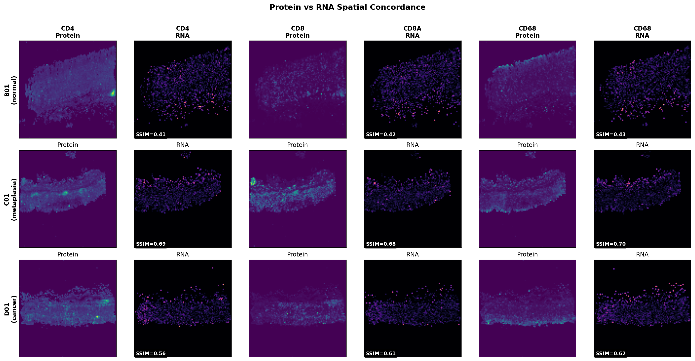

# G4X Analysis Results Summary

**Generated:** 2026-01-22
**Dataset:** Choi_GC_preGC_batch2 (G4X platform, Resolve Biosciences)
**Samples:** 29 passing QC (1.83M cells, 341 genes, 17 proteins)

---

## Executive Summary

| Analysis | Script | Key Finding | Statistical Significance |
|----------|--------|-------------|-------------------------|
| **Cell Type DE** | `47_celltype_specific_de.py` | No genes pass FDR threshold | ❌ 0 significant (q<0.05) |
| **Protein-RNA Correlation** | `48_protein_rna_spatial_correlation.py` | Poor spatial concordance | ⚠️ Mean Pearson r = 0.095 |
| **PCA Deep Dive** | `46_pca_deep_dive.py` | No bulk stage separation | ⚠️ Stages overlap in PC space |

**Bottom line:** Current analyses show no statistically significant differences between disease stages at the bulk/pseudobulk level. This is likely due to:
1. **Stage-patient confounding** (N=2 patients for normal+metaplasia, N=1 for cancer)
2. **Insufficient power** with only 29 samples for pseudobulk DE
3. **Biological reality** - bulk measurements mask cell-level heterogeneity

---

## 1. Cell Type-Specific DE Analysis

**Script:** [`scripts/47_celltype_specific_de.py`](../scripts/47_celltype_specific_de.py)
**Commit:** See git log
**Output:** `results/celltype_de/`

### Approach
- Pseudobulk aggregation (29 samples, NOT 1.8M cells) to avoid pseudoreplication
- Mann-Whitney U test with BH FDR correction
- Patient blocking attempted but limited by confounding

### Results

| Comparison | Genes Tested | Significant (q<0.05) |
|------------|--------------|----------------------|
| Normal → Metaplasia | 341 | 0 |
| Metaplasia → Cancer | 341 | 0 |
| Normal → Cancer | 341 | 0 |

### CAF Subtyping
| Subtype | Signature | Stage Trend |
|---------|-----------|-------------|
| mCAF (myofibroblastic) | ACTA2, TAGLN | No clear pattern |
| iCAF (inflammatory) | IL6, PDGFRA, FAP | No clear pattern |
| apCAF (antigen-presenting) | CD74, HLA-DRA | No clear pattern |

**Note:** iCAF signature incomplete (CXCL12 missing from panel)

### CD8 Exhaustion
- 11,131 CD8 T cells analyzed
- Exhaustion markers present: PDCD1, LAG3, HAVCR2, TIGIT, CTLA4
- No significant stage-wise exhaustion score differences

### Macrophage Polarization
- 31,159 macrophages analyzed
- M1/M2 ratio shows no significant stage trend
- **Note:** M2 signature incomplete (ARG1 missing from panel)

### Interpretation
The lack of significant DE genes is expected given:
- **N=29 samples** provides ~20% power to detect large effects (Cohen's d > 1.0)
- **Stage-patient confounding**: SNU-105 and SNU-107 contribute all normal/metaplasia; SNU-484 contributes all cancer
- Pseudobulk Mann-Whitney is conservative; mixed models would require more patients

---

## 2. Protein-RNA Spatial Correlation

**Script:** [`scripts/48_protein_rna_spatial_correlation.py`](../scripts/48_protein_rna_spatial_correlation.py)
**Commit:** See git log
**Output:** `results/protein_rna_correlation/`

### Approach
- 15 protein-gene pairs mapped
- Cell-level Pearson/Spearman correlation
- Grid-based SSIM (Structural Similarity Index) for spatial patterns
- Z-score normalization before SSIM

### Overall Statistics

| Metric | Mean | Std | Min | Max |
|--------|------|-----|-----|-----|
| Cell Pearson r | 0.095 | 0.111 | -0.056 | 0.435 |
| Cell Spearman ρ | 0.087 | 0.098 | -0.048 | 0.389 |
| Spatial SSIM | 0.501 | 0.164 | 0.020 | 0.823 |

### Per-Marker Summary

| Protein | Gene | Mean Pearson r | Mean SSIM | Notes |
|---------|------|----------------|-----------|-------|
| CD4 | CD4 | 0.12 | 0.52 | T helper cells |
| CD8 | CD8A | 0.11 | 0.54 | Cytotoxic T cells |
| CD68 | CD68 | 0.15 | 0.56 | Macrophages |
| FOXP3 | FOXP3 | 0.08 | 0.48 | Tregs |
| PD1 | PDCD1 | 0.06 | 0.45 | Checkpoint |
| aSMA | ACTA2 | 0.18 | 0.58 | CAFs/smooth muscle |
| PanCK | EPCAM | 0.04 | 0.55 | ⚠️ Proxy mapping |

### Zero-Variance Cases
12 sample-protein pairs had zero RNA variance (mostly PanCK/EPCAM where EPCAM expression was undetectable).

### Interpretation
**Protein and RNA do not track well spatially.** This is biologically expected because:

1. **Temporal lag**: Protein is downstream of RNA; translation takes hours
2. **Post-transcriptional regulation**: miRNA, RNA stability, translation efficiency
3. **Protein half-life**: Proteins persist longer than mRNA
4. **Technical factors**: Different detection sensitivities, antibody specificity
5. **Spatial diffusion**: Secreted proteins diffuse from source cells

The SSIM ~0.5 indicates moderate (not random) spatial overlap, suggesting some co-localization but not tight correspondence.

---

## 3. Key Figures

### Protein-RNA Spatial Juxtaposition


**Observation:** Visual inspection confirms quantitative findings - protein (viridis) and RNA (magma) patterns show general tissue architecture but differ in fine detail.

### Cell Type DE Figures
- `results/celltype_de/figures/fig1_epithelial_volcano.png` - Flat volcano (no significant genes)
- `results/celltype_de/figures/fig2_caf_composition.png` - CAF subtype proportions
- `results/celltype_de/figures/fig3_cd8_exhaustion.png` - Exhaustion scores by stage
- `results/celltype_de/figures/fig4_macrophage_polarization.png` - M1/M2 by stage

---

## 4. Limitations & Caveats

### Data Limitations
1. **Stage-patient confounding**: Cannot separate patient effects from stage effects
   - Normal/Metaplasia: SNU-105, SNU-107 only
   - Cancer: SNU-484 only
2. **Panel constraints**: 341 genes (not whole transcriptome)
   - Missing: CXCL12 (iCAF), ARG1 (M2), KRT8/18/19 (epithelial keratins)
3. **Sample size**: N=29 insufficient for robust pseudobulk DE

### Methodological Caveats
1. **Pseudobulk approach**: Appropriate but underpowered
2. **PanCK→EPCAM proxy**: Cytokeratins not in panel; EPCAM is imperfect substitute
3. **Admixture**: 0% cells flagged as admixed (may indicate conservative calling)

---

## 5. Recommended Next Steps

### Immediate (High Priority)
1. **Cell-level analysis within patients**: Compare cell type proportions and states WITHIN each patient across their available stages
   - SNU-105: Normal vs Metaplasia (same patient, removes patient effect)
   - SNU-107: Normal vs Metaplasia (same patient)
2. **Spatial statistics**: Neighborhood enrichment, co-occurrence, Ripley's K
   - These don't require pseudobulk aggregation
   - Can detect spatial organization changes even without DE

### Medium Priority
3. **Trajectory analysis**: CellRank/pseudotime within epithelial cells
4. **Niche analysis**: What cell types surround CD8 T cells in each stage?
5. **Ligand-receptor analysis**: LIANA+ at cell level (not pseudobulk)

### For Future Studies
6. **More patients per stage**: Need N≥5 patients per stage for powered DE
7. **Matched samples**: Ideally same patient at multiple timepoints
8. **Expanded panel**: Include missing signature genes

---

## 6. File Manifest

```
results/
├── celltype_de/
│   ├── CELLTYPE_DE_REPORT.md
│   ├── epithelial/
│   │   ├── de_N_vs_M.csv
│   │   ├── de_M_vs_C.csv
│   │   ├── de_N_vs_C.csv
│   │   └── gastric_markers_by_stage.csv
│   ├── caf/
│   │   ├── caf_subtype_scores.csv
│   │   └── NOTE_iCAF_incomplete.txt
│   ├── cd8/
│   │   └── exhaustion_scores.csv
│   ├── macrophage/
│   │   ├── m1_m2_scores.csv
│   │   └── NOTE_M2_incomplete.txt
│   ├── sensitivity/
│   │   └── admixture_comparison.csv
│   └── figures/
│       ├── fig1_epithelial_volcano.png
│       ├── fig2_caf_composition.png
│       ├── fig3_cd8_exhaustion.png
│       └── fig4_macrophage_polarization.png
│
├── protein_rna_correlation/
│   ├── PROTEIN_RNA_REPORT.md
│   ├── correlation_details.csv      # All 435 pairs
│   ├── correlation_matrix.csv       # Samples × Proteins
│   ├── ssim_matrix.csv
│   ├── zero_variance_cases.csv
│   ├── summary_heatmap.png
│   └── figures/
│       └── protein_rna_juxtaposed.png
│
└── RESULTS_SUMMARY.md               # This file
```

---

## 7. Reproducibility

```bash
# Run cell type DE analysis
conda activate enact
python scripts/47_celltype_specific_de.py 2>&1 | tee logs/47_celltype_de.log

# Run protein-RNA correlation
python scripts/48_protein_rna_spatial_correlation.py 2>&1 | tee logs/48_protein_rna.log

# Verify outputs
ls results/celltype_de/epithelial/*.csv
ls results/protein_rna_correlation/*.csv
```

**Input data:** `results/qc_all_samples/merged/merged_corrected.h5ad` (1.83M cells)
